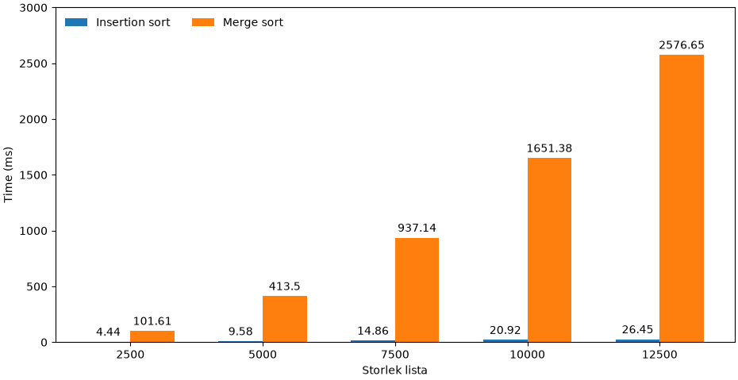

# Performance Test
## Vecka 36
 
 

### Status uppgifter

| Uppgift                         | Status | 🟠🟡🟢 |
|---------------------------------|--------|--------|
| 0 Projektstruktur               | 100%   | 🟢     |
| 1 Diskussion                    | 100%   | 🟢     |
| 2 Prestandatest: insertion sort | 100%   | 🟢     |
| 3 Prestandatest: merge sort     | 0%     | 🟡     |

2.4: För att rita diagrammet. Kör prestandatest.main.

3.1:  
Merge sort O(N^2) (Kvadratisk) - Dåligt för stora datamängder  
Insertion sort O(N) (Linjär) - Bättre för stora datamängder

Visualisering:

